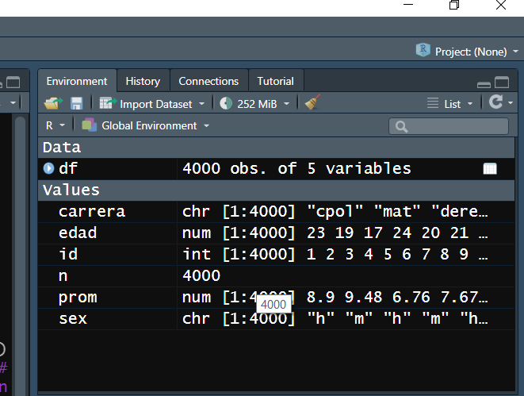
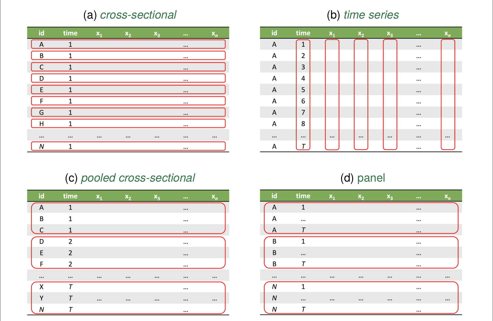
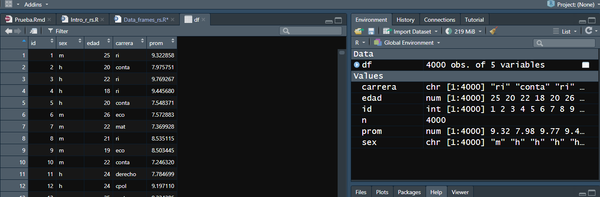

```{r setup, include=FALSE}
knitr::opts_chunk$set(echo = TRUE)
```

# Data Frames

## Data Frames

En la sesión anterior vimos vectores. El siguiente paso natural es analizar bases de datos

* No son otra cosa que un conjunto de vectores del mismo tamaño

* Los data frames son un tipo de objeto: algunas funciones requieren que las tablas sean Data frames. 

# Repaso: Creación de DF

## 

Aprovechemos lo aprendido para crear un DF. 
Creemos una base de datos de n=4000 alumnos del ITAM que contenga: 

* un numero natural que l@ identifique
* sexo
* edad
* carrera: eco, cpol, ri, derecho, conta, mat
* promedio general

Para crear la base de datos necesitamos cada uno de los vectores

##
Una práctica común es poner el tamaño de la base de datos como una variable, para poder modificarla fácilmente posteriormente. 
Los primeros dos vectores sabemos cómo hacerlos

```{r}
n<-4000
id<-1:n
sex<-sample(c('h','m','o'), n, replace = T)
```

##

 Para crear edades aleatorias podemos usar las funciones de distribución incorporadas en R. 

* R tiene incorporadas funciones para generar vectores que provengan de las distribuciones de probabilidad más comunes: 
* runif() para la distribución uniform
* rnorm()
* rbinom()
* etc. 

Solo se deben especificar los parámetros pertinentes y el tamaño del vector

* Adicionalmente, qnorm() se usaría para ver los cuantiles

##
En nuestro caso conviene usar la uniforme:
```{r, results='hide'}
edad<-runif(n, min = 17, max = 27) 
```


Que salgan decimales es extraño, apliquémosle la función piso.

```{r}
edad<-floor(edad)
```

##
Creemos el resto de los vectores

```{r}
carrera<-sample(c('eco','cpol','ri','derecho','conta','mat'), n, replace = T)
prom<-runif(n, 6, 10)
```

## Creación de Data Frames

Crear data frames es muy sencillo, se hace con la funcion data.frame()

```{r}
df<-data.frame(id, sex, edad, carrera, prom)
```

# Unidad de observación y variables
##
El recién creado Data Frame aparece en el environment. 



## Unidad de observación

* Definición: es la unidad mínima en la que puede cambiar el valor de una variable

* Es cada una de las filas de la base de datos. En nuestro caso, los alumnos. 

* Si una categoría aparece varias veces, por sí sola no puede ser la unidad de observación.

* Ejemplos: 
  + Diputados
  + País-año
  + alumnos-semestre

## Tipos de datos

4 tipos de datos: 

* Cross-sectional/ de corte transversal
* Series de tiempo
* pooled cross sections
* panel/ "time series cross-sectional" 

## Cross_sectional/ de corte transversal
* Cada unidad aparece una sola vez. Es una fotografía de la unidad tomada en un punto particular del tiempo
* NO HAY UNIDADES DE TIEMPO
* Ejemplos: 
  + Encuestas 
  
## Series de tiempo

* Observaciones de UNA entidad a lo largo del tiempo.
* El orden importa
* Ejemplos: 
  + PIB
  + Tasas de interés
  
## Pooled cross section
* Combinaciones de al menos dos *cross-sections*
* mismas variables son analizadas para al menos dos periodos de tiempo, pero sin seguir a las mismas unidades. 
* Seguir individuos es costoso: mejor tomas muestras representativas en distintos periodos de tiempo. 
* Ejemplos: 
  + LAPOP
  + ENIGH
  
## Panel / Time series cross-sectional

* Una serie de tiempo para cada miembro cross-sectional
* un conjunto de entidades es observado varias veces en el tiempo
* Ejemplos:
  + Líderes mundiales
  + Datos OCDE
  
## Observaciones y variables

* Las observaciones son las filas: las entidades mínimas que estamos observando
* Las **variables** son aquello que estamos observando de la unidad de observación: las columnas

## Tipos de datos: resumen


# Semillas

## 
  
Podemos hacer click sobre el df en el environment para que nos lo muestre R



##

* ¡Pero cada quien obtendría un df distinto!
* Las variables de sexo, edad, carrera y promedio las obtuvimos usando cierta aleatoriedad

## Semillas

* En realidad, R no utiliza valores aleatorios, sino pseudo-aleatorios a través de algoritmos. 
* Gracias a dichos algoritmos podemos replicar los valores pseudo-aleatorios usando la función set.seed()

```{r}
set.seed(2020)
```

## 
si corremos la función set.seed() y el mismo número, y luego corremos la misma base de datos, deberíamos obtener el mismo df. 

```{r}
df<-data.frame(
  id=1:n,
  sex=sample(c('h','m','o'), n, replace = T),
  edad=floor(runif(n, min=17, max=27)),
  carrera=sample(c('eco','cpol','ri','derecho','conta','mat'), n, replace = T),
  prom=runif(n, 6, 10)
  )
```

* Nota que también podemos crear el df directamente, sin generar las variables. 

## Hacia una mayor replicabilidad

Siempre que trabajemos con datos aleatorios en un proyecto hay que incluir la semilla para que nuestros resultados sean replicables. 

# Visualizaciones del DF

## 

* Como vimos, podemos hacer click en el df en el environment para ver el df. 
* Podemos nombrarlo en la consola 
* Podemos usar funciones preestablecidas para darnos una mejor idea de los datos que estamos viendo. 

## Funciones para visualizar

* summary() Muestra un pequeño resumen para cada variable: media, max, min. 
* head() Muestra las primeras observaciones
* str() muestra algunas variables y qué tipo de objeto son. 

## Particiones de Df

* Podemos extraer los vectores de las variables con '$' 

```{r}
df$prom
```
## 

Podemos operar con este vector como antes

```{r}
df$prom[5]
mean(df$prom)
```

## Slices de DF
Podemos especificar partes del df

```{r, eval=FALSE}
df[filas, columnas]
```


* Por ejemplo, si queremos las primeras dos filas y las columnas 2-3 y 5

```{r}
df[1:2, c(2:3,5)]
```

# Algunas funciones importantes para DF

## with()
A menudo, conviene usar la función with() para operar con los vectores en lugar de llamarlos con $

* Por ejemplo, calculemos el promedio de los promedios. 

```{r}
with(df, mean(prom))
```
## subset()

subset() permite quedarnos con observaciones que cumplan ciertas características

* Por ejemplo, creemos un df solo con las observaciones de mujeres que estudian RRII

```{r}
df_female_ri<-subset(df, sex=='m' & carrera=='ri')
```

* recuerden sus operadores lógicos
* Reemplacen esta función con filter(df, condición) cuando veamos dplyr


## ifelse()

Las variables dicotómicas (dummies) son fundamentales para la econometría. Podemos crearlas fácilmente con la función ifelse()

ifelse(*condición a cumplir*, 
*qué pone R en caso de cumplirla*, 
*qué pone en caso de que no*)

* Podemos crear variables con df$new.var<-

* ifelse() también funciona para vectores independietes

##
Creemos una dummy que indique si es una alumna

```{r}
df$female<-ifelse(sex=='m', 1, 0)
```

* *Crea una columna llamada female: pon un uno en caso de ser mujer, pon un 0 e.o.c*


# Ejercicios

## Con el df creado

* Calcula el promedio de los hombres que estudian economía. 
* Calcula la proporción de mujeres que estudian matemáticas. Para esto, recuerda que el promedio de una dummy es la proporción de observaciones que cumplen la característica. 
* ¿Cuál es el id del hombre con promedio más alto en la carrera de Ciencia Política? Para esto, recuerda la función max() o sort()
* Crea una variable que identifique con un número la carrera: 1= eco, 2=ri, 3=e.o.c.  Para esto, concatena ifelse()
* Obtén el DF de las mujeres que estudian RRII, pero con slices. 

## Creación de DF tipo panel
Creemos una base de datos de vacunación. 
Hay tres tipos de individuos: niños, adultos y audltos mayores. Hay tres periodos de tiempo: 1,2,3. Los adultos mayores se vacunan en  el primer periodo; los adultos en el segundo; niños en el tercero. 
Crea una base de datos tipo panel  con un identificador, una variable de edad (con distribucion uniforme y redondeada al entero menor), una variable de tiempo y una dummy que valga uno si al individio-tiempo le corresponde una vacuna. 
