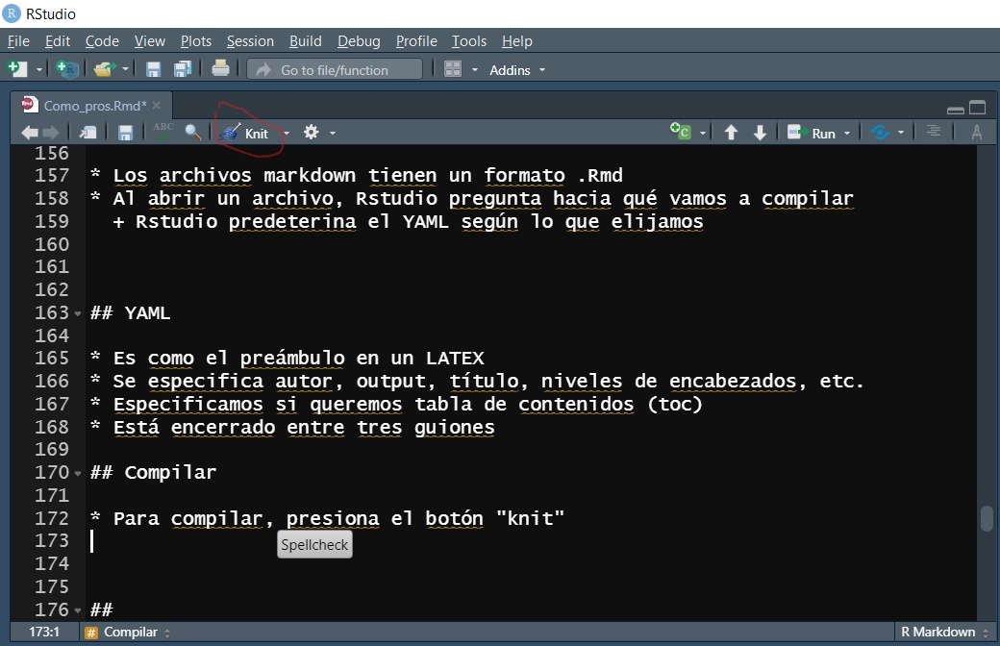

```{r setup, include=FALSE}
knitr::opts_chunk$set(echo = TRUE)
```

```{r, include=FALSE}
setwd('C:/Users/rodri/OneDrive - INSTITUTO TECNOLOGICO AUTONOMO DE MEXICO/Labs MIA/05_Como_pros')
```

# Intro

## Algunos consejos

* Podemos hacer un trabajo más eficiente con algunos consejos extras 
* El objetivo final es automatizar y facilitar la replicabilidad
* Nunca sabemos cuándo vamos a ocupar código previamente hecho. 

# Carpetas

## Nube

* Usa servicios de nube
* Configura para que la carpeta salga en el explorador de archivos


##

* Más fácil compartir proyectos y trabajar colaborativamente
  + Solo coordínenese para editar el archivo para no empalmarse
  + Si quieren, pueden aprender "git", pero es muy sofisticado para lo que vamos a hacer.

* El almacenamiento es casi ilimitado, aunque caro
  + Pero el ITAM ofrece una suscripción con 1TB 
  
## 

* Si van a compartir carpetas, conviene usar **if** para no tener que cambiar los directorios todo el tiempo
* Por ejemplo, Mauricio Romero trabaja en varias compus y corre el siguiente código

```{r, eval=FALSE}
if(Sys.info()["user"]=="Mauricio") setwd("C:/Users/Mauricio/Dropbox/Teaching/Microeconometria/")
if(Sys.info()["user"]=="MROMEROLO") setwd("D:/Dropbox/Teaching/Microeconometria/")
if(Sys.info()["user"]=="mauri") setwd("C:/Users/mauri/Dropbox/Teaching/Microeconometria/")
```

* Así, no importa en dónde trabaje, solo corre el código.
* Ideal para no tener que cambiar el wd en trabajos colaborativos


  
## Organización de carpetas

* Nuestro proyecto debe ser una carpeta asequible y con título identificable

* Por sencillo que sea nuestro proyecto, deberíamos tener al menos tres subcarpetas:
  + Data
  + Code
  + Docs
  
## 

Un proyecto final va a tener muchas más subcarpetas

* Por ejemplo, en data, podemos hacer una carpeta de "raw data" y otra de datos editados
* Carpetas para los distintos lenguajes de programación

  
# Master file

## source()

* **source()** ayuda a citar archivos de R
* Ejecuta el archivo citado en el R script que estemos usando
* Solo hay que especificar el path

```{r, eval=FALSE}
source('Como_pros_rs.R')
```

* Los objetos del script citado se guardan en el nuevo archivo
* En este caso, conviene haber cambiado previamente el directorio de trabajo

## Master File

 Un Master File es un R script que:
 
* vacíe el ambiente
* cambie el directorio de trabajo 
* carge todas las librerías 
* cite el resto de los scripts que necesitemos

##


## 

Nota que:

* cuando citamos el código con **source()** , como ya cambié el directorio, solo debo poner en el path las subcarpetas dentro del directorio
  + Pasa lo mismo cuando quieres guardar archivos generados en R
  
* Dentro de la carpeta de Code, nombra tus códigos primero con números_ el nombre del archivo   para que se ordenen como desees. El master debe ser el 00
  
## Replicabilidad

* Cuando compartas tu trabajo con un asesor de tésis (o algo parecido), lo ideal es que compartas una carpeta comprimida y que  solo tengan que cambiar su directorio en el Master y el resto debe fluir
* Como hemos trabajado, así debería ser 
* Solo falta la instalación de paquetes automática
* Es muy sofisticado, tomé el ejemplo de Mauricio Romero

##

```{r, eval=FALSE}
list.of.packages <- c("rstan","metafor") #Paquetes nuevos
new.packages <- list.of.packages[
  !(list.of.packages %in% installed.packages()[,"Package"])]
if(length(new.packages)) install.packages(new.packages,
                                          dependencies=TRUE)
```


# R Markdown

## Markdown

* Para procesar reportes usando R, lo más sencillo es usar Rmarkdown
* El lenguaje identifica qué es texto y qué código de R
* Podemos compilar a muchos formatos: html, PDF, etc.
* Con respecto a Latex:
  + Markdown es más sencillo, pero se puede hacer menos
  + Markdown entiende la sintáxis de Latex-> podemos escribir matemáticas de la misma manera
  + Incorporar código es mucho más fácil
  
## Settings

* Descarga el paquete "knitr", si es que no lo tienes

* Ve a la cinta  **Tools-> Global-> Sweave** Options y configura como sigue


  
## Abrir .Rmd

* Los archivos markdown tienen un formato .Rmd
* Al abrir un archivo, Rstudio pregunta hacia qué vamos a compilar
  + Rstudio predetermina el YAML según lo que elijamos
  

  
## YAML

* Es como el preámbulo en un LATEX 
* Se especifica autor, output, título, niveles de encabezados, etc. 
* Especificamos si queremos tabla de contenidos (toc)
* Está encerrado entre tres guiones

## 

```{r, eval=FALSE}
---
title: "Como pros"
author: "Rodrigo Negrete Pérez"
date: \today

theme: "CambridgeUS"
colortheme: 'beaver'
output: 
  beamer_presentation:
    slide_level: 2
    toc: true
---
```

## Compilar

* Para compilar, presiona el botón "knit" 


##

* Markdown compila según el formato elegido en el YAML
* Podemos elegir dónde lo va a compilar (donde está el archivo Rmd o el actual wd)
* Se abre una ventana para visualizar
* Nuevas renderizaciones sobreescriben


## Sintaxis

Podemos escribir naturalmente. Para insertar otros objetos, además del texto, necesitamos algunos comandos

* Para crear un nuevo párrafo (enter), basta con dos espacios  
* Los encabezados los encerramos entre "#"
  + Si vamos agregando "#" al principio y al final, se hace un subencabezado
* imagen:
```{r, eval=FALSE}

```

## Itálicas, negritas, bullets

* itálicas: encerramos texto entre *
* negritas: " " **

* Bullets: iniciamos texto con * (no encerramos, solo uno)
* guiones: " " - 

## Ecuaciones

* Markdown entiende la sintaxis de Latex
  + Si quieren algún símbolo, mejor busquen cómo se hace en Latex
* Si queremos ecuaciones en el texto las encerramos con $
* Si las queremos centradas, las encerramos con 

$\backslash$[ ecuacion $\backslash$]

* subíndices: _ (encierra con {} si varios)
* superíndices: ^ 

* Letras griegas: $\backslash$ + letra escrita 

# Code Chunks

## Inline code

* Evidentemente, lo que queremos es incertar código en el documento
* Para hacerlo al interior del texto, lo encerramos entre

```{r, eval=FALSE}
`r  codigo `
```

* Sirve para automatizar el valor de una variable, coeficiente, etc. 

## Code Chunks

* Para figuras, seguramente queremos insertar un chunk

* El chunk es la manera de decirle a markdown que lo que sigue no es texto, sino código


````
```{r, eval=TRUE}`r ''`
1 + 1
```
````
* Markdown muestra el output del código, de acuerdo con lo que especifiquemos entre las llaves y después de la r, 
{r, **display options**} 

* En el ejemplo, la display option era **eval=TRUE**

* Podemos incertar un chunk fácilmente con Ctrl+Alt+i

## display options

La página de ayuda RMarkdown indica que:

* include = FALSE prevents code and results from appearing in the finished file. R Markdown still runs the code in the chunk, and the results can be used by other chunks.
* echo = FALSE prevents code, but not the results from appearing in the finished file. This is a useful way to embed figures.
* message = FALSE prevents messages that are generated by code from appearing in the finished file.
* warning = FALSE prevents warnings that are generated by code from appearing in the finished.
* fig.cap = "..." adds a caption to graphical results

## 

Lo más probable es que usen:  


+ echo=F
  + Markdown muestra el output, pero no el código de donde viene
  
* include=F
  + Markdown ejecuta el código, pero no aparece ni output ni código en el doc
  
* results='asis' 
  + muestra el output como texto. Sirve cuando el output de una función es texto que luego se copia para insertar en Latex. Por ejemplo, pueden hacer una tabla de regresión con stargazer( ,type='latex') en un chunk con results='asis' para mostrar la tabla. 
  
* cache=T. Para guardar en el cache chunks *pesados* y que no se tarde tanto cada vez que compilemos  
  

##

* Se pueden poner varias opciones, solo que separada por una coma  
  

* Podemos personalizar la opción de display predeterminada, revisa una de las presentaciones de este laboratorio para ver cómo (es que reproducirlo en un markdown para fines didácticos es casi imposible)


# Sweave (Latex en Rstudio)

## Latex en Rstudio

* Como parte de knitr, sweave permite tener Latex en R. 
* Abre un archivo R Sweave con formato .Rnw
* No tiene opciones de autocompletar, así que requiere cierto dominio de Latex

## Chunks

Funciona igual que en Rmarkdown, solo que los chunks son diferentes (mismas display options)

$<<<$  echo= F $>>>=$

@

* Y para poner en el texto, se hace con **Sexpr{** 'code' **}**

## Figuras y tablas

 Necesitamos introducirlas como lo haríamos normalmente en Latex:

$\backslash$begin{figure} ... etc

Solo que, en medio, pondríamos el chunk con el display correspondiente (echo= F, ):

* Figuras-> fig=T
* Tablas-> results='asis' 


Para tablas, recomiendo usar el paquete xtable

##

Para más información de Latex en R, consulten el documento de Mario Alfonso Morales Rivera en la carpeta de Cheat_sheets

# Reportes automatizados

## Reportes Automatizados vs Proyectos largos

Las ventajas de Sweave o Markdown son la automatización. Si configuramos todo adecuadamente, podemos realizar reportes periódicos con ligeras modificaciones a los datos y casi todo estaría listo

##

* Pero para reportes de largo aliento (tesis), que requieren hacer microcambios, lo mejor es que guarden sus figuras o tablas  en lugares asequibles, y luego inclúyanlas en sus documentos. 

* Evidentemente, lo mejor es Latex, por su manejo de ecuaciones, personalización e inclusión de archivos. R ya escupe tablas en Latex, solo que tendrán que copiar y pegarlas de la consola. 

* Pero recomiendo otra plataforma, no Sweave para esto
  + Overleaf para web
  + Texworks (Windows)
  + Texshop (MacOS)

## Tareas MPA

El módulo está pensado para facilitar su trabajo en R, particularmente para sus trabajos de MPA. 


Mis recomendaciones para estos escritos: 

* Sigan la lógica de las carpetas para poder trabajar en equipo más fácilmente

* Hagan su Rscript, primero y no directamente en Rmarkdown. Recomiendo hacer un Masterfile solo para tareas largas, puesto que tienen que entregar un solo Rscript. 
  + Guarden las figuras y/o tablas de las preguntas en una variable que puedan recordar fácilmente: p2a, por ejemplo

##

* Una vez que ya tengan su Rscript, hagan un documento Rmarkdown. 
  + Cambien la display option predeterminada a echo=F
  + Citen su Rscript con source() en un chunk: include=F, cache=T
  + Hagan su escrito e incorporen código solo para llamar lo que necesiten, ya sea inline code o chunks

* Para tablas de regresión en stargazer:
  + Selecciona el type='latex' 
  + En las display options del chunk: results='asis' 
  
  


