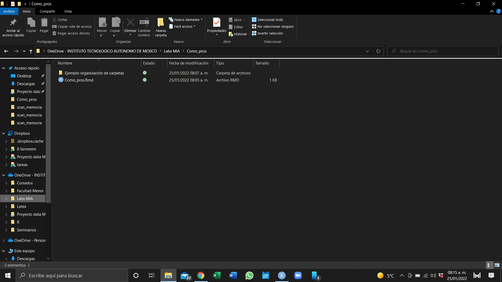
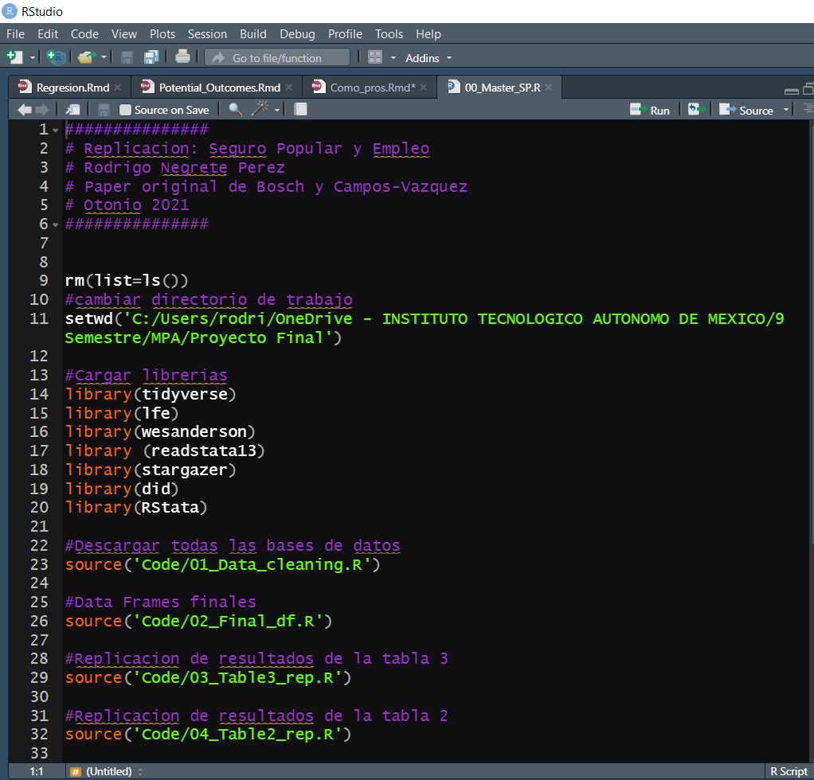
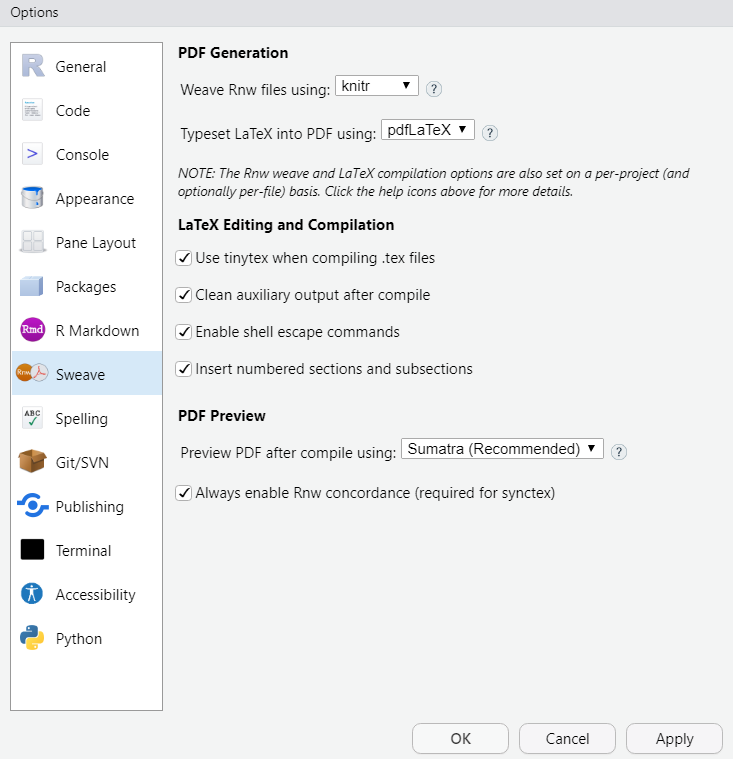

```{r setup, include=FALSE}
knitr::opts_chunk$set(echo = TRUE)
```

```{r}
setwd('C:/Users/rodri/OneDrive - INSTITUTO TECNOLOGICO AUTONOMO DE MEXICO/Labs MIA/Como_pros')
```

# Intro

## Algunos consejos

* Podemos hacer un trabajo más eficiente con algunos consejos extras 
* El objetivo final es automatizar y facilitar la replicabilidad
* Nunca sabemos cuándo vamos a ocupar código previamente hecho. 

# Carpetas

## Nube

* Usa servicios de nube
* Configura para que la carpeta salga en el explorador de archivos




##

* Más fácil compartir proyectos y trabajar colaborativamente
  + Solo coordínenese para editar el archivo para no empalmarse
  + Si quieren, pueden aprender "git", pero es muy sofisticado para lo que vamos a hacer.

* El almacenamiento es casi ilimitado, aunque caro
  + Pero el ITAM ofrece una suscripción con 1TB 
  
## 

* Si van a compartir carpetas, conviene usar **if** para no tener que cambiar los directorios todo el tiempo
* Por ejemplo, Mauricio Romero trabaja en varias compus y corre el siguiente código

```{r, eval=FALSE}
if(Sys.info()["user"]=="Mauricio") setwd("C:/Users/Mauricio/Dropbox/Teaching/Microeconometria/")
if(Sys.info()["user"]=="MROMEROLO") setwd("D:/Dropbox/Teaching/Microeconometria/")
if(Sys.info()["user"]=="mauri") setwd("C:/Users/mauri/Dropbox/Teaching/Microeconometria/")
```

* Así, no importa en dónde trabaje, solo corre el código


  
## Organización de carpetas

* Nuestro proyecto debe una carpeta asequible y con título identificable

* Por sencillo que sea nuestro proyecto, deberíamos tener al menos tres subcarpetas:
  + Data
  + Code
  + Docs
  
## 

Un proyecto final va a tener muchas más subcarpetas

* Por ejemplo, en data, podemos hacer una carpeta de "raw data" y otra de datos editados
* Carpetas para los distintos lenguajes de programación

##

* Para un ejemplo más sofisticado, consulten la carpeta de ejemplo en Github.
* Es la tesis doctoral de Mauricio Romero, profesor del departamento de Eco

  
# Master file

## source()

* **source()** ayuda a citar archivos de R
* Ejecuta el archivo en el R script que estemos usando
* solo hay que especificar el path

```{r, eval=FALSE}
source('Como_pros_rs.R')
```

* Los objetos del script citado se guardan en el nuevo archivo
* En este caso, conviene haber cambiado previamente el directorio de trabajo

## Master File

 Un Master File es un R script que:
 
* vacíe el ambiente
* cambie el directorio de trabajo 
* carge todas las librerías 
* cite el resto de los scripts que necesitemos

##



## 

Nota que:

* cuando citamos el código con **source()** , como ya cambié el directorio, solo debo poner en el path las subcarpetas dentro del directorio
  + Pasa lo mismo cuando quieres guardar archivos generados en R
  
* Dentro de la carpeta de Code, nombra tus códigos primero con números_ el nombre del archivo   para que se ordenen como desees. El master debe ser el 00
  
## Replicabilidad

* Cuando compartas tu trabajo con un asesor de tésis (o algo parecido), lo ideal es que solo tengan que cambiar su directorio en el Master y el resto debe fluir
* Como hemos trabajado, así debería ser. 
* Solo falta la instalación de paquetes automática
* Es muy sofisticado, en caso de duda, consulta el ejemplo de Mauricio en la carpeta de ejemplo

##

```{r, eval=FALSE}
list.of.packages <- c("rstan","metafor") #Paquetes nuevos
new.packages <- list.of.packages[!(list.of.packages %in% installed.packages()[,"Package"])]
if(length(new.packages)) install.packages(new.packages,dependencies=TRUE)
```


# R Markdown

## Markdown

* Para procesar reportes usando R, lo más sencillo es usar Rmarkdow
* El lenguaje identifica qué es texto y qué código de R
* Podemos compilar a muchos formatos: html, PDF, etc.
* Con respecto a Latex:
  + Markdown es más sencillo, pero se puede hacer menos
  + Markdown entiende la sintáxis de Latex-> podemos escribir matemáticas de la misma manera
  + Incorporar código es mucho más fácil
  
## Settings

* Descarga el paquete "knitr", si es que no lo tienes

* Ve a la cinta  **Tools-> Global-> Sweave** Options y configura como sigue



  


