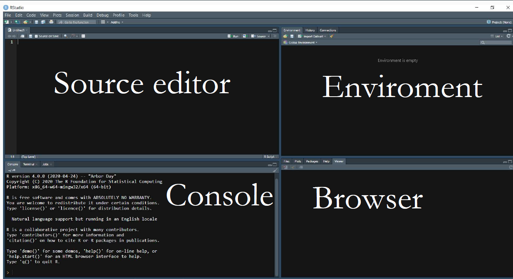

---
title: "Intro a R"
author: "Rodrigo Negrete Pérez"
date: \today

theme: "CambridgeUS"
colortheme: 'beaver'
output: 
  beamer_presentation:
    slide_level: 2
    toc: true
---

```{r setup, include=FALSE}
knitr::opts_chunk$set(echo = TRUE)
```


# Idea de los Labs

## Teoría y Práctica
El curso de MIA se centra en la pregunta de la causalidad. 
Han proliferado algunas estrategias de identificación: esenciales para el portafolio de cualquier científico social.

* Parte teórica: intuición de cómo funcionan las estrategias de identificación
* Parte práctica: aplicarlas a un conjunto de datos. 
 
Peeero... tenemos que aprender R.

## Inspiración de los labs. 
A grandes razgos, baso estos labs en tres fuentes/profesores:

* Mauricio Romero (Profesor de Economía del ITAM)
  + https://mauricio-romero.com/teaching/microeconometria-aplicada-otono-2021/
* Nick Huntington (Profesor en quien se apoyó Mauricio)
  + https://nickchk.com/econometrics.html#learnR
* Curso de MPA de Adrián Lucardi-> Eventualmente lo llevarán. 

Animo a checar estas fuentes ante cualquier inquietud adicional. 

# Material de los labs

## Github
Todo el material de apoyo de los labs estará en Github.

* RodrigoNP/Labs_MIA
  
# Estructura de los labs

## Introducción a R
Una parte de los labs se enfocará en R.

* Nociones básicas del lenguaje: vectores, loops, funciones
* Análisis de datos (Dplyrs)
* Ggplot

Cualquiera que quiera aprender R puede asistir. 

## R aplicado a MIA
La otra parte será aplicar R a MIA. 

* Simulaciones
* Aplicación de estrategias de identificación
* Algunas nociones básicas para entender papers. 

Estos labs se darán cuando se haya cubierto el material del curso pertinente. 

# ¿Qué es R?

## Lenguaje orientado a objetos

A grandes razgos, con R podemos: 

* Crear objetos
* Manipular objetos
* Ver objetos

¿Qué es un objeto? 
En nuestro caso, todo lo relacionado a datos: variables, observaciones, regresiones, tablas de regresión. 

## ¿Por qué R?

* Gratis: todo mundo lo usa, hasta autores. 
* Como con la gramática: aprendes uno y entiendes el resto (parecido a Python)
* Replicabilidad

# Interfaz


## Consola

* Podemos ejecutar código aquí, sin embargo, no se guarda
* Muestra los errores en otro color (QUE SIEMPRE HAY QUE LEER)
* Muestras las advertencias (warnings). 

## Environment

Destacan el environment y y el historial 

* El historial es un registro del código corrido 
* El environment es un registro de los objetos que hemos creado
 + podemos borrarlo con rm(list=ls()) o con la escobita
 
## Navegador

* Podemos ver archivos y paquetes instalados
* PANEL DE AYUDA
* Gráficas

## Source 
A pesar de que el código se puede ejecutar en la consola, aquí deberían trabajar el código. El código aquí se guarda: REPLICABILIDAD. 

* Después de escribir, se puede ejecutar con ctrl+ enter, seleccionando previamente
  + o picando los botones arrriba en la pestaña del source, etc. 
* R no ejecuta nada despues de #, así que se pueden hacer comentarios después de un #

## Ayuda

* R puede autocompletar nombre de variables, funciones, etc. 
* Podemos buscar una funcion en el navegador y saldrá la documentación. O también podemos ejecutar el commando help(función)
* GOOGLEEN: R se aprende más en StackOverflow que en cursos. 

# Creación y tipos de objetos 

## Creación de objetos

* Creamos objetos con <- , =  o ->
Hay muchos tipos de objetos, veamos los más básicos

```{r, include=T}
numeric.var<-1
character.var<-'Mexico'
factor.var<-factor(1, labels = 'one')
logic.var<- TRUE #Booleanos # TRUE= T, FALSE= F
```

* Los objetos creados se pueden ver en el environment

## 

* Si los ejecutamos, R los muestra. Si solo quieres ver el objeto, conviene  hacerlo en la consola para no tener que borrarlo otra vez

```{r, include=T}
numeric.var
```

## 
* Podemos preguntarle a R si un objeto es de algun tipo con is.tipo

```{r}
is.numeric(numeric.var)
```

* y podemos usar as.tipo para cambiar entre tipos de variables

```{r}
as.character(numeric.var)
as.numeric(numeric.var)
as.factor(character.var)

```

## 
Modificar un objeto lo sobreescribe: NO GUARDA DOS VERSIONES, ANULA LA ANTERIOR Y SE QUEDA CON LA NUEVA

```{r}
numeric.var
numeric.var<-3+sqrt(9)+9^4-4+9/7
numeric.var
```
 * nótese el uso de los operadores algebráicos comunes. 
 * recordemos que la consola no guarda, así que ahí podemos hacer cálculos rápidos.
 
 
## Caracteres o strings
 
Son un trozo de texto encerrado entre comillas. Podemos usar dos comillas o el apóstrofe (que recomiendo porque es más rápido)

```{r, include=TRUE}
name<-'Rodrigo'
```

## Lógicos o Booleanos
Podemos preguntarle algo a R y nos contesta con un TRUE o FALSE

```{r}
a<-59

a>100
```

## 
Como en casi todos los lenguajes, los operadores son:

* & para 'y', 'intersección de conjuntos'

* | para 'o inclusiva', 'unión de conjuntos'

* == 'igual a'

* $>=$ 'mayor o igual a' 

Algo útil es que TRUE=1 y FALSE=0
```{r}
T+3
```

## Práctica
```{r, results='hide'}
is.logical(is.numeric(FALSE))
is.numeric(2)+is.character('hola')
T|F
T & F
```

##
```{r, echo=F}
is.logical(is.numeric(FALSE))
is.numeric(2)+is.character('hola')
T|F
T & F
```

## Factores
Son variables categóricas mutuamente excluyentes. Se ven como caracteres, pero tienen niveles, que son el número de categorías. 

```{r}
consolas<-as.factor('xbox')

```

podemos añadir niveles de una manera mas sencilla

```{r}
levels(consolas)<-c('xbox','switch','ps5')
consolas
```

# Vectores

## Vectores o listas

Podemos concatenar objetos usando c( ). De preferencia, que sean del mismo tipo. Un vector es una lista de objetos, una colección de objetos. Podemos saber su longitud usando lenght()

```{r}
vector<-c(1,4,5,6)
vector<-c(vector, 1,4,6,8,9)
length(vector)
```

## Slices (particiones)

Podemos llamar a partes específicas de los vectores utilizando paréntesis. 
Dentro de los paréntesis podemos especificar las posiciones deseadas o incluir un operador lógico

```{r}
vector<-c(1,4,5,6)
vector[3]
vector[vector<5]
```

## :

Un operador habitual es ':' que se interpreta como de x a y. 

```{r}
vector<-c(1,4,5,6)
vector[1:3]
```

También podemos hacer series

```{r}
series<-1:10
series
```

## !

* Otro operador es '!' que se interpreta como el complemento 
```{r}
vector<-c(1,4,5,6,15,3,20)
vector[vector<5]
vector[! vector<5]
```

## 
Muchas funciones utilizan vectores
```{r}
mean(vector); sd(vector); prod(vector)
```

##

o puedes operar con los vectores mismos, y funciona como un vector matemático

```{r}
r<-c(1,4,6,4,2,5,9)
r*2
r+r
r>=4
```

##

Como vimos, podemos utilizar factores para ver cuantas observaciones pertenecen a una categoría

```{r}
carreras<-as.factor(c('eco','eco','cpol','ri','ri'))
table(carreras)
```

## %in% 
Usamos el operador '%in%' para ver si un objeto pertenece a un vector. Denota si un objeto está dentro de un vector. 

```{r}
carreras<-c('eco','eco','cpol','ri','ri')
'mat' %in% carreras
```

## Otras funciones
Para simulaciones seguramente usaremos rep() y sample (). rep() copia un vector y lo repite algunas veces.

* rep(*objeto a repetir*, *número de veces a repetir* )


```{r}
rep(4,4) 
a<-c(1,7,9)
rep(a,3)
```
##
Podemos hacer vectores de ceros o de texto vacío

```{r}
numeric(5) #vector de 0 el numero de veces indicada

character(6) # lo mismo, pero para characters
```

## 
sample() toma una muestra aleatoria. Se puede especificar el reemplazo

* sample( *objeto para tomar la muestra*, *tamaño de muestra*, replace= FALSE )

```{r}
sample(1:10,3) 
a<-c(2,4,5,6,1,3,12,45,56)
sample(a,4)
sample(a, 2, replace = F) 
```

## Menciones honorables
* sort() acomoda las entradas del vector según se especifique
* unique() da las entradas únicas en un vector con posibles repeticiones
* max()
* min()
* length() da la longitud del vector

## Particiones con vectores independientes
Podemos hacer particiones lógicas, incluso usando otro vector. 

```{r}
coin_toss<-sample(
  rep(c('aguila', 'sol')), 10 , 
  replace = T)

y<-1:10

y[coin_toss=='aguila']
```

# Ejercicios Mauricio Romero

## Ejericios tomados de Mauricio Romero
```{r message=FALSE, warning=FALSE, results='hide'}
f<-c(2,7,5,1)
f^2
f + c(1,2,3,4)
c(f,6)
is.numeric(f)
mean(f >= 4)
f*c(1,2,3)
length(f)
length(rep(1:4,3))
f/2 == 2 | f < 3
as.character(f)
f[1]+f[4]
c(f,f,f,f)
f[f[1]]
f[c(1,3)]
f %in% (1:4*2)

```

##
```{r, echo=F}
f^2
f + c(1,2,3,4)
c(f,6)
is.numeric(f)
mean(f >= 4)
f*c(1,2,3)
length(f)
length(rep(1:4,3))


```

##
```{r, echo=FALSE}
f/2 == 2 | f < 3
as.character(f)
f[1]+f[4]
c(f,f,f,f)
f[f[1]]
f[c(1,3)]
f %in% (1:4*2)
```

## 
* Crea un factor que seleccione aleatoriamente entre seis personas que pueden ser hombre, mujer u otro género
* Averigua la suma acumulada entre 45 y 987 y súmale la media de todos estos números. (averigua la función para suma acumulada)
* Reacomoda h<-c(1,3,5,23,-4) de mayor a menor
* ¿Cuántos múltiplos de 4 hay entre 344 y 899? (averigua cómo sacar residuos no econométricos)